<!-- ══════════════════════════════════════════════════════════════════════════
     ██████╗ SHAHRIAR AHMED SEAM — GitHub Profile README
     ══════════════════════════════════════════════════════════════════════════ -->

<!-- ─────────────────────────── HERO SECTION ─────────────────────────── -->

<div align="center">

<!-- -->


<!-- -->

<!-- Animated Typing SVG -->
[](https://git.io/typing-svg)

<!-- Custom Banner -->


<!-- Status Badges -->
<p>
  <a href="https://www.linkedin.com/in/shahriar-ahmed-seam/"></a>
  
  
</p>

<!-- Profile Views -->


<!-- Social Connectivity -->
<p>
  <a href="https://www.linkedin.com/in/shahriar-ahmed-seam/"></a>
  <a href="https://www.facebook.com/Shahriar.Ahmed.Seam"></a>
  <a href="https://www.instagram.com/shahriar_seam_/"></a>
  <a href="https://www.kaggle.com/shahriarahmedseam"></a>
  <a href="https://scholar.google.com/citations?hl=en&user=qKUzwGwAAAAJ"></a>
  <a href="https://www.researchgate.net/profile/Shahriar-Seam-2"></a>
  <a href="https://hashnode.com/@shahriar-ahmed-seam"></a>
  <a href="https://codeforces.com/profile/Fizonel"></a>
  <a href="https://leetcode.com/u/fizonel/"></a>
</p>

</div>

---

<!-- ─────────────────────── ABOUT ME ─────────────────────── -->

##  About Me

```yaml
name: Shahriar Ahmed Seam
location: Bangladesh 🇧🇩
education:
  degree: B.Sc. in Computer Science & Engineering
  university: Bangladesh University of Engineering & Technology (BUET)

roles:
  - AI/ML Researcher
  - Competitive Programmer
  - Open Source Enthusiast

currently:
  researching: "Brain Lesion Segmentation, Computer Vision, NLP"
  learning: "Large Language Models & Generative AI"
  building: "Deep Learning Pipelines & Research Toolkits"

fun_fact: "I debug with print statements and I'm not ashamed 🐛"
```

---

<!-- ─────────────────── ACADEMIC & RESEARCH ─────────────────── -->

## 🎓 Academic & Research

<table>
<tr>
<td width="50%" valign="top">

### 🔬 Research Interests
- 🧠 **Computer Vision** — Medical Image Analysis, Segmentation
- 💬 **Natural Language Processing** — Text Understanding, Transformers
- 🤖 **AI / Machine Learning** — Deep Learning, Neural Architectures
- 🧬 **Large Language Models (LLMs)** — Fine-tuning, RAG, Agents
- 🎨 **Generative AI** — Diffusion Models, GANs, Image Synthesis

</td>
<td width="50%" valign="top">

### 🏛️ Education
| | |
|---|---|
| 🎓 **Degree** | B.Sc. in CSE |
| 🏫 **University** | BUET |
| 📍 **Location** | Dhaka, Bangladesh |

### 📊 Research Profiles
<p>
  <a href="https://scholar.google.com/citations?hl=en&user=qKUzwGwAAAAJ"></a>
  <a href="https://www.researchgate.net/profile/Shahriar-Seam-2"></a>
</p>

</td>
</tr>
</table>

### 📝 Featured Publication

> **SYNAPSE-Net: A Unified Framework with Lesion-Aware Hierarchical Gating for Robust Segmentation of Heterogeneous Brain Lesions**
>
> <a href="https://scholar.google.com/citations?hl=en&user=qKUzwGwAAAAJ"></a>

---

<!-- ─────────────── COMPETITIVE PROGRAMMING & DS ─────────────── -->

## 🏆 Competitive Programming & Data Science

<div align="center">
<table>
<tr>
<td align="center" width="50%">

###  Codeforces
<a href="https://codeforces.com/profile/Fizonel">
  
</a>

</td>
<td align="center" width="50%">

###  LeetCode
<a href="https://leetcode.com/u/fizonel/">
  
</a>

</td>
</tr>
</table>
</div>

<div align="center">

###  Kaggle

<a href="https://www.kaggle.com/shahriarahmedseam">
  
  
  
  
</a>

</div>

---

<!-- ─────────────────── TECHNICAL SKILLS ─────────────────── -->

## 🛠️ Technical Skills & Tools

<div align="center">

### 💻 Core Languages
<p>
  
</p>

### 🤖 AI / ML / DL Libraries
<p>
  
  
  
  
  
  
  
  
</p>

### 🌐 Web & Frameworks
<p>
  
  
  
</p>

### 🗄️ Databases
<p>
  
</p>

### 🛠️ Dev Tools & Platforms
<p>
  
</p>


</div>

### 🏅 Skill Proficiency

```text
Computer Vision       ████████████████████████░░   95%
Natural Language Proc ██████████████████████░░░░   88%
Deep Learning         █████████████████████████░   96%
Full Stack Development████████████████████░░░░░░   76%
Competitive Prog      ██████████████████░░░░░░░░   72%
Data Engineering      ████████████████░░░░░░░░░░   64%
```

---

<!-- ────────────────── GITHUB METRICS ────────────────── -->

## 📈 GitHub Metrics

<div align="center">

<!-- GitHub Stats Card -->
<p align="center">
  
  
</p>

<!-- Streak Stats -->
<p align="center">
  
</p>

<!-- GitHub Trophies -->
<p align="center">
  
</p>

</div>

<!-- Contribution Graph -->
<br/>
<div align="center">
  
</div>

<!-- Contribution Snake Animation -->
<div align="center">
  <picture>
    <source media="(prefers-color-scheme: dark)" srcset="https://raw.githubusercontent.com/shahriar-ahmed-seam/shahriar-ahmed-seam/output/github-snake-dark.svg" />
    <source media="(prefers-color-scheme: light)" srcset="https://raw.githubusercontent.com/shahriar-ahmed-seam/shahriar-ahmed-seam/output/github-snake.svg" />
    
  </picture>
</div>

---

<!-- ────────────────── PROJECTS SHOWCASE ────────────────── -->

## 🚀 Featured Projects

<div align="center">

<a href="https://github.com/shahriar-ahmed-seam?tab=repositories">
  
</a>

</div>

<br/>

| # | Project | Description | Tech Stack | Status |
|:-:|---------|-------------|:----------:|:------:|
| 1 | [**SYNAPSE-Net**](https://github.com/shahriar-ahmed-seam) | Unified framework for robust brain lesion segmentation |   | ✅ Published |
| 2 | [**Cough-Diagnosis**](https://github.com/shahriar-ahmed-seam/Cough-Diagnosis) | AI-powered cough analysis and diagnosis system |   | ✅ Complete |
| 3 | [**Gram-Sheba**](https://github.com/shahriar-ahmed-seam/Gram-Sheba) | Rural development platform for community services |  | ✅ Complete |

> 💡 **Tip:** Pin your best repositories on your GitHub profile for maximum visibility!

---

<!-- ────────────────── CODING JOURNEY ────────────────── -->

## 🗺️ My Coding Journey

```mermaid
timeline
    title Shahriar's Journey 🚀
    section Getting Started
        Learned C/C++          : Started competitive programming
        Joined BUET CSE        : Deep dive into CS fundamentals
    section Growth
        Python & ML            : Discovered Machine Learning
        First Kaggle Comp      : Entered the data science world
    section Research Phase
        Computer Vision        : Focus on medical image analysis
        SYNAPSE-Net Paper      : First research publication
    section 2025-2026
        LLMs & GenAI           : Exploring frontier AI
        Open Source             : Contributing to the community
```



---

<!-- ────────────────── INTERACTIVE & FUN ────────────────── -->

## 🎮 Interactive & Fun

<div align="center">

<!-- Spotify Now Playing -->
<!--
  🎵 To enable Spotify "Now Playing", deploy https://github.com/novatorem/novatorem
  or https://github.com/kittinan/spotify-github-profile and replace the URL below.
-->
<!--
<a href="https://open.spotify.com/user/YOUR_SPOTIFY_ID">
  
</a>
-->

<!-- Random Dev Quote -->
<br/>

### 💬 Random Dev Quote


<br/>

<!-- GitHub City (3D Contribution Graph) -->
### 🏙️ My GitHub City

<a href="https://honzaap.github.io/GithubCity/?name=shahriar-ahmed-seam&year=2025">
  
</a>

<br/><br/>

<!-- Guestbook -->
### 📝 Guestbook
*Leave me a message! Open an [issue here](https://github.com/shahriar-ahmed-seam/shahriar-ahmed-seam/issues/new?title=Guestbook+Entry&body=Hey+Shahriar!+👋) to say hi!*

<a href="https://github.com/shahriar-ahmed-seam/shahriar-ahmed-seam/issues/new?title=Guestbook+Entry&body=Hey+Shahriar!+%F0%9F%91%8B+Just+visited+your+profile!">
  
</a>

</div>

---

<!-- ────────────────── SPOTIFY (Optional) ────────────────── -->

<!--
## 🎧 Now Playing on Spotify

<div align="center">
  <a href="https://open.spotify.com/user/YOUR_SPOTIFY_ID">
    
  </a>
</div>

---
-->

<!-- ────────────────── BLOG POSTS ────────────────── -->

## ✍️ Latest Blog Posts

<div align="center">
  <a href="https://hashnode.com/@shahriar-ahmed-seam">
    
  </a>
  <a href="https://custom-llm-twicking.hashnode.dev/">
    
  </a>
</div>

<br/>

<!-- BLOG-POST-LIST:START -->
- Coming soon...
<!-- BLOG-POST-LIST:END -->

➡️ [Read more on my blog](https://custom-llm-twicking.hashnode.dev/)

---

<!-- ────────────────── SUPPORT ────────────────── -->

## 💖 Support My Work

<div align="center">

If you find my research or projects helpful, consider:

<a href="https://github.com/shahriar-ahmed-seam"></a>
<a href="https://www.linkedin.com/in/shahriar-ahmed-seam/"></a>
<a href="https://scholar.google.com/citations?hl=en&user=qKUzwGwAAAAJ"></a>

<!--
<a href="https://www.buymeacoffee.com/YOUR_USERNAME"></a>
-->

</div>

---

<!-- ────────────────── FOOTER ────────────────── -->

<div align="center">


<p>
  <i>"The only way to do great work is to love what you do."</i> — Steve Jobs
</p>


</div>
